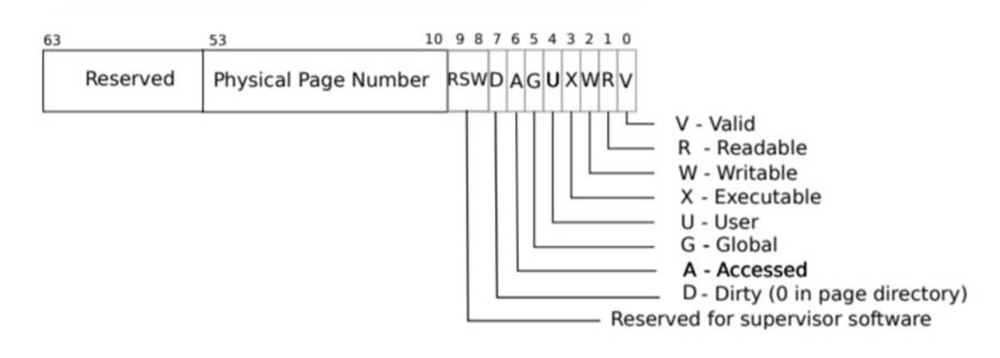
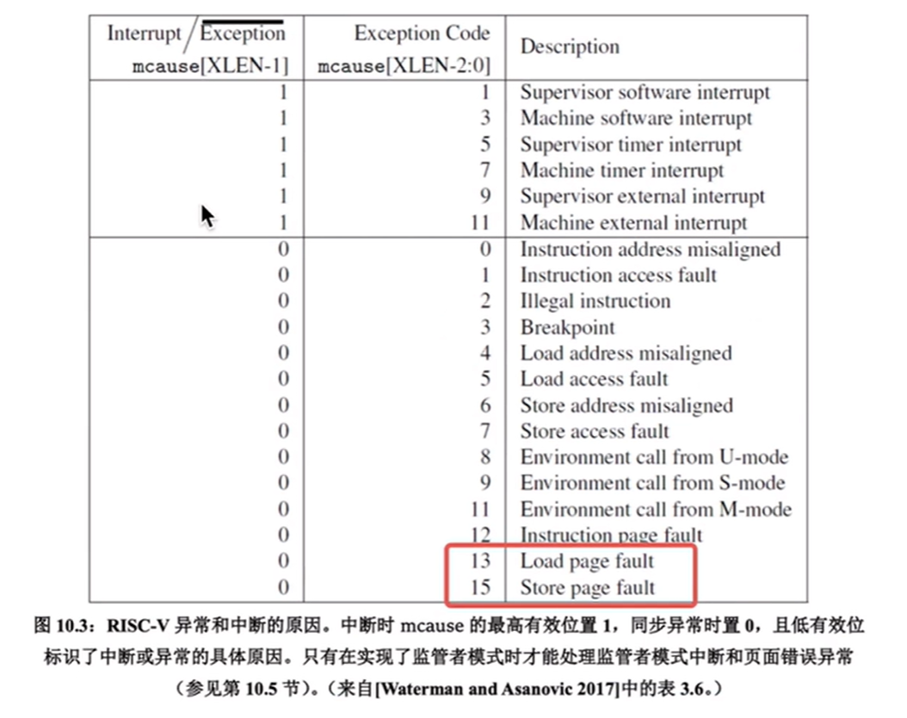
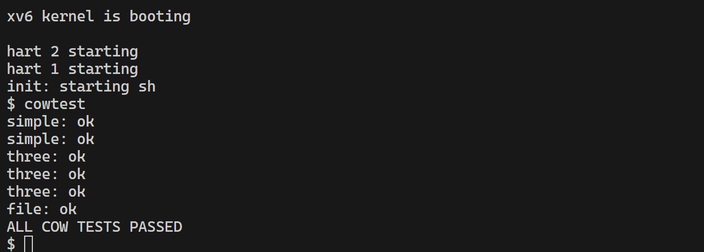

## 题目
https://pdos.csail.mit.edu/6.828/2022/labs/cow.html


## 思路

1. fork时，直接将子进程页表映射到父进程的物理地址，将父子进程的写权限禁用，标记为cow页
2. 进程写时，触发page fault后trap到内核，在usertrap中处理：
     - 如果是cow页，申请新物理页，将内容拷贝到新物理页，修改页表，标记为非cow页，断掉旧的映射（unmap）
     - 如果不是cow页，panic
3. 修改kfree，只有引用计数为1时才释放内存
4. 修改kalloc，初始化引用计数=1
5. 修改uvmcopy，引用计数++


## 代码
```C
// 将原来copy的逻辑注释掉，直接将子进程页表映射到父进程的物理地址，将父子进程的写权限禁用，标记为cow页
int
uvmcopy(pagetable_t old, pagetable_t new, uint64 sz)
{
  pte_t *pte;
  uint64 pa, i;
  uint flags;
  // char *mem;

  for(i = 0; i < sz; i += PGSIZE){
    if((pte = walk(old, i, 0)) == 0)
      panic("uvmcopy: pte should exist");
    if((*pte & PTE_V) == 0)
      panic("uvmcopy: page not present");

    // disable the writing permission if it had,
    // make the COW bit 1 if it could write
    *pte = PTE_ONCOW(*pte);
    pa = PTE2PA(*pte);
    flags = PTE_FLAGS(*pte);
    // if((mem = kalloc()) == 0)
    //   goto err;
    // memmove(mem, (char*)pa, PGSIZE);
    if(mappages(new, i, PGSIZE, pa, flags) != 0){
      //kfree(mem);
      goto err;
    }
    incr(pa);
  }
  
  return 0;

 err:
  uvmunmap(new, 0, i / PGSIZE, 1);
  return -1;
}
```

在trap处理入口，处理page fault

```c
// trap.c
else if(r_scause() == 12 || r_scause() == 15 )
  {
    // page fault
    uint64 va = r_stval();
    pte_t *pte;
    if(va >= MAXVA) goto err;
    if((pte = walk(p->pagetable, va, 0)) == 0)
    {
      printf("usertrap: walk\n");
      setkilled(p);
    }
    if((*pte) & PTE_COW)
    {
      //printf("before cow: pte = %p\n", *pte);
      if(uvmcow(p->pagetable, va) < 0)
      {
        panic("usertrap: uvmcow");
      }
    } else{
      printf("usertrap: page fault but not cow page\n");
      printf("name = %s\n", p->name);
      printf("pte = %p\n", *pte);
      printf("usertrap(): unexpected scause %p pid=%d\n", r_scause(), p->pid);
      printf("            sepc=%p stval=%p\n", r_sepc(), r_stval());
      setkilled(p);
    }

  }
```
对于cow页，我们调用uvmcow方法，将cow页映射到新的物理页，并修改pte
```C
// this method can only use when (*pte & PTE_COW) != 0
// unmap the old mapping
// alloc a new writable page for va, 
// and map the new page to pgtbl
// return -1 while it is not a cow pte
// return -0 while succeed
int
uvmcow(pagetable_t pgtbl, uint64 va)
{
  va = PGROUNDDOWN(va);
  pte_t *pte;
  if((pte = walk(pgtbl, va, 0)) == 0)
      panic("uvmunmap: walk");
  if((*pte) & PTE_COW)
  {
    uint64 pa = PTE2PA(*pte);
    uint64 flags = PTE_FLAGS(*pte);
    flags &= (~PTE_COW);
    flags |= (PTE_W);
    // alloc a new page
    char *mem;
    if((mem = kalloc()) == 0)
      panic("uvmcow: not enough page");
    memmove(mem, (char*)pa, PGSIZE);

    uvmunmap(pgtbl, va, 1, 1);

    mappages(pgtbl, va, 1,(uint64) mem, flags);
  } else
  {
    return -1;
  }
  return 0;
}
```


## 测试结果



