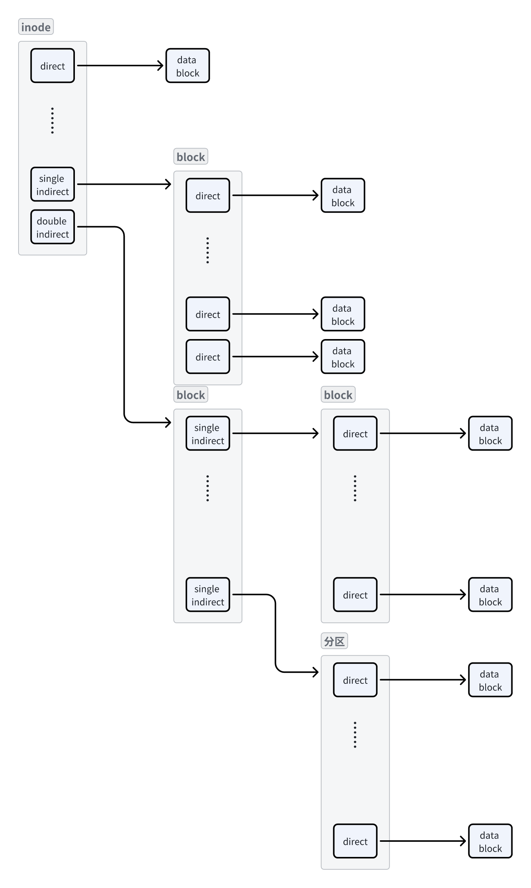
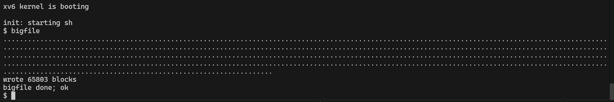

## 题目

https://pdos.csail.mit.edu/6.828/2022/labs/fs.html

## 思路



## 代码
**主要要修改bmap和itrunc函数**

bmap原来只能处理直接映射和一级间接映射
```c
bmap(struct inode *ip, uint bn)
{
  uint addr, *a;
  struct buf *bp;

  if (bn < NDIRECT)
  {
    if ((addr = ip->addrs[bn]) == 0)
    {
      addr = balloc(ip->dev);
      if (addr == 0)
        return 0;
      ip->addrs[bn] = addr;
    }
    return addr;
  }
  bn -= NDIRECT;

  // single level indirect block
  if (bn < NINDIRECT)
  {
    // Load indirect block, allocating if necessary.
    if ((addr = ip->addrs[NDIRECT]) == 0)
    {
      addr = balloc(ip->dev);
      if (addr == 0)
        return 0;
      ip->addrs[NDIRECT] = addr;
    }
    bp = bread(ip->dev, addr);
    a = (uint *)bp->data;
    if ((addr = a[bn]) == 0)
    {
      addr = balloc(ip->dev);
      if (addr)
      {
        a[bn] = addr;
        log_write(bp);
      }
    }
    brelse(bp);
    return addr;
  }

  bn -= NINDIRECT;
  // double level indirect block

  panic("bmap: out of range");
}
```
我们写一个递归函数来处理一二级映射，也能很方便拓展成三级映射
```c
// Return the disk block address of the nth block in inode ip.
static uint
bwalk(struct inode *ip, uint *cur, uint off, ushort level, uint clevel)
{
  uint addr;
  // Load indirect block
  if(*cur==0)
    *cur = balloc(ip->dev);
  if(*cur==0) return 0;
  struct buf *bp = bread(ip->dev, *cur);
  uint *a = (uint *)bp->data;
  uint toff = off / power(NINDIRECT, level - clevel);
  if ((addr = a[toff]) == 0)
  {

    addr = balloc(ip->dev);

    if (addr)
    {
      a[toff] = addr;
      log_write(bp);
    }
  }
  brelse(bp);
  if (clevel == level)
  {
    return addr;
  }
  else
  {
    if (a[toff])
      return bwalk(ip, &a[toff], off - toff * power(NINDIRECT, level - clevel), level, clevel + 1);
    else
      return 0;
  }
}
```

bmap可以修改为
```C
static uint
bmap(struct inode *ip, uint bn)
{
  uint addr;
  if (bn < NDIRECT)
  {
    if ((addr = ip->addrs[bn]) == 0)
    {
      addr = balloc(ip->dev);
      if (addr == 0)
        return 0;
      ip->addrs[bn] = addr;
    }
    return addr;
  }
  bn -= NDIRECT;

  // single level indirect block
  if (bn < NINDIRECT)
  {
    return bwalk(ip, &(ip->addrs[NDIRECT]), bn, 1, 1);
  }
  bn -= NINDIRECT;
  // double level indirect block
  if (bn < NINDIRECT * NINDIRECT)
  {
    return bwalk(ip, &(ip->addrs[NDIRECT + 1]), bn, 2, 1);
  }

  panic("bmap: out of range");
}
```

itrunc的修改是类似的
```C
void bwalkfree(struct inode *ip, uint *cur, uint level, uint clevel)
{
  uint j;
  struct buf *bp = bread(ip->dev, *cur);
  uint *a = (uint *)bp->data;
  for (j = 0; j < NINDIRECT; j++)
  {
    if (level != clevel)
    {
      if (a[j])
        bwalkfree(ip, &a[j], level, clevel + 1);
    }
    else
    {
      if (a[j])
        bfree(ip->dev, a[j]);

    }
  }
  brelse(bp);
  bfree(ip->dev, *cur);
  *cur = 0;
}

// Truncate inode (discard contents).
// Caller must hold ip->lock.
void itrunc(struct inode *ip)
{
  int i;

  for (i = 0; i < NDIRECT; i++)
  {
    if (ip->addrs[i])
    {
      if (ip->addrs[i] < 30)
        panic("itrunc: error\n");
      bfree(ip->dev, ip->addrs[i]);
      ip->addrs[i] = 0;
    }
  }

  if (ip->addrs[NDIRECT])
  {
    bwalkfree(ip, &(ip->addrs[NDIRECT]), 1, 1);
  }

  if (ip->addrs[NDIRECT + 1])
  {
    bwalkfree(ip, &(ip->addrs[NDIRECT + 1]), 2, 1);
  }

  ip->size = 0;
  iupdate(ip);
}
```


## 测试结果



