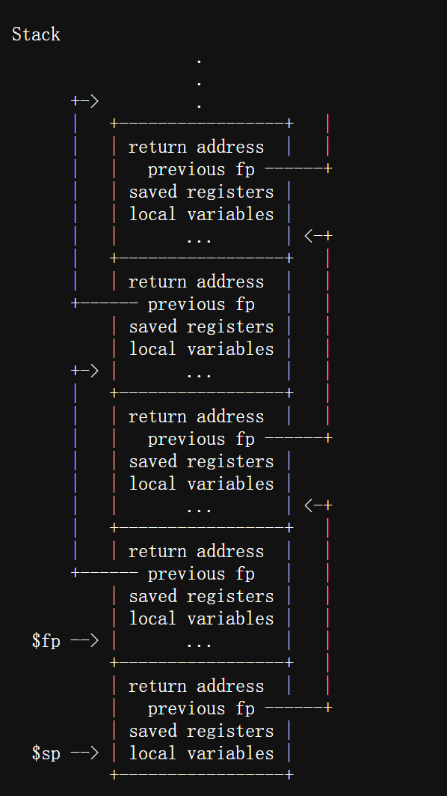
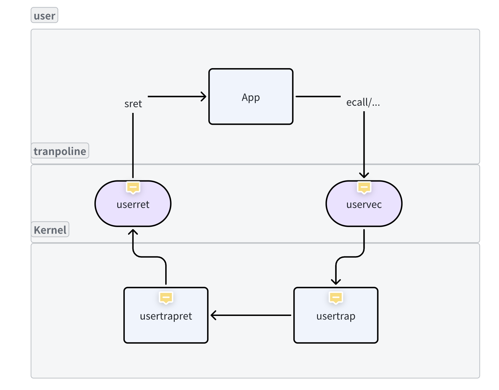
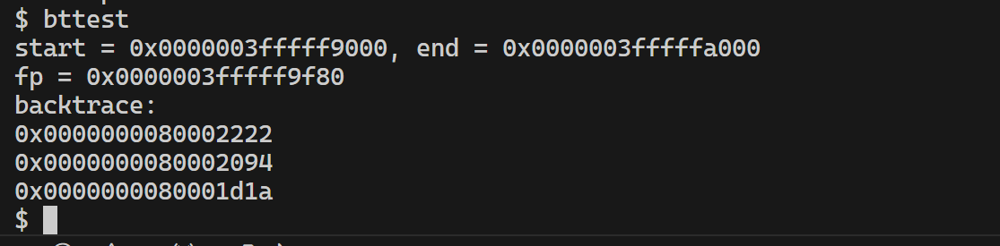
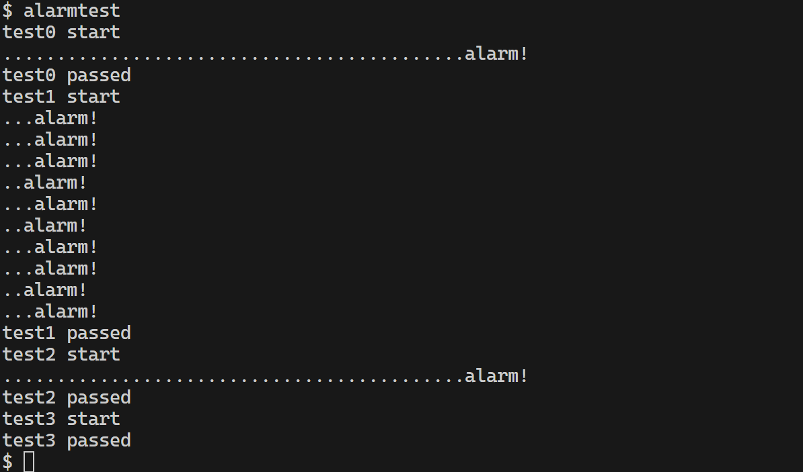

## 题目
https://pdos.csail.mit.edu/6.828/2022/labs/traps.html


## 思路
### backtrace

s0寄存器保存了当前栈帧的fp，只需要格局栈帧排布图来计算ra和pre_fp相对于fp的偏移量，迭代到页表边界，即可把函数调用链输出。需要注意栈顶在低地址，栈底在高地址。

### alarm
关键是理解陷入过程和回到用户空间的过程


## 代码
### backtrace
```C
// trace back stacks while panic
void
backtrace(void)
{
  uint64 pre_fp = r_fp();
  uint64 start = PGROUNDDOWN(pre_fp);
  uint64 end = PGROUNDUP(pre_fp);
  uint64 ra;
  printf("start = %p, end = %p\n",start, end);
  printf("fp = %p\n", pre_fp);
  printf("backtrace: \n");
  while(pre_fp != end)
  {
    ra = *((uint64*)(pre_fp-8));
    printf("%p\n",ra);
    pre_fp=*((uint64*)(pre_fp-16));

  }

} 
```

### alarm
修改proc数据结构
```C
    // 在proc结构体中增加
  int ainterval;               // alarm interval
  void (*handler)();           // handler function
  int nticks;                  // number of ticks 
  struct trapframe tickframe;  // store the trapframe when ticking
  int tickstatus;              // status = 0 imply not in handle fn, status = 1 imply handling
  
```
需要在定时中断中增加计数，直到触发internel
如果触发中断，将trapframe存到tickframe，修改trapframe中的epc，
使得回到用户空间后可以从回调函数开始执行
```C
  // give up the CPU if this is a timer interrupt.
  if(which_dev == 2){
    struct proc *p = myproc();
    p->nticks++;
    if(p->ainterval != 0 && p->ainterval == p->nticks && p->tickstatus == 0)
    {
      // set the tickstatus = 1, imply handling
      p->tickstatus = 1;

      // store the trapframe in tickframe
      p->tickframe = *(p->trapframe);

      // alloc a new proc for the handle fn
      p->trapframe->epc = (uint64)p->handler;
      p->nticks = 0;
      usertrapret();
    }
    yield();
  }
```
实现定时中断系统调用
```C
// 将中断间隔，回调函数存到proc结构体中
uint64
sys_sigalarm(void)
{
  struct proc *p = myproc();
  argint(0, &(p->ainterval));
  argaddr(1, (uint64*)&(p->handler));
  p->nticks=0;
  // printf("interval ticks = %d\n", p->ainterval);
  // printf("handler addr = %p\n", p->handler);
  return 0;
}

// 在用户程序的回调函数最后调用，用来向kernel发出恢复原始上下文的请求
uint64
sys_sigreturn(void)
{
  // store the value in a0
  //uint64 a0;
  struct proc *p = myproc();
  // recover the context
  *(p->trapframe) = p->tickframe;
  
  // set the tickstatus = 0, imply not in handle fn
  p->tickstatus = 0;
  return p->tickframe.a0;
}
```


## 测试结果

